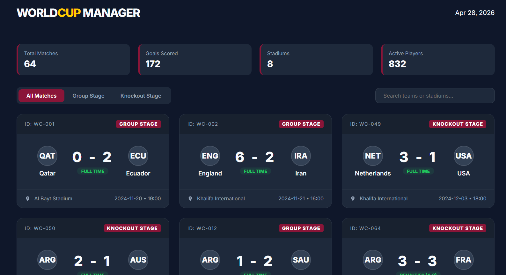
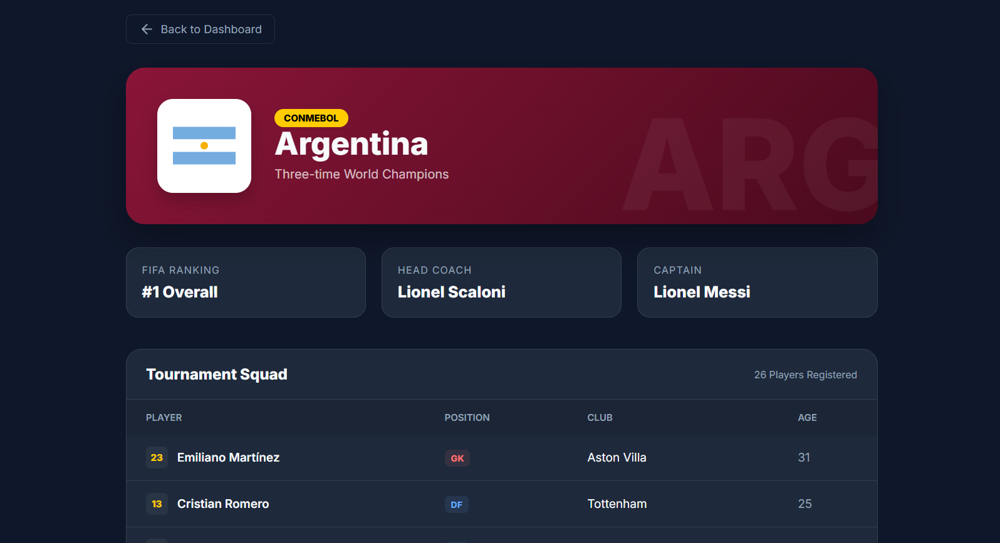
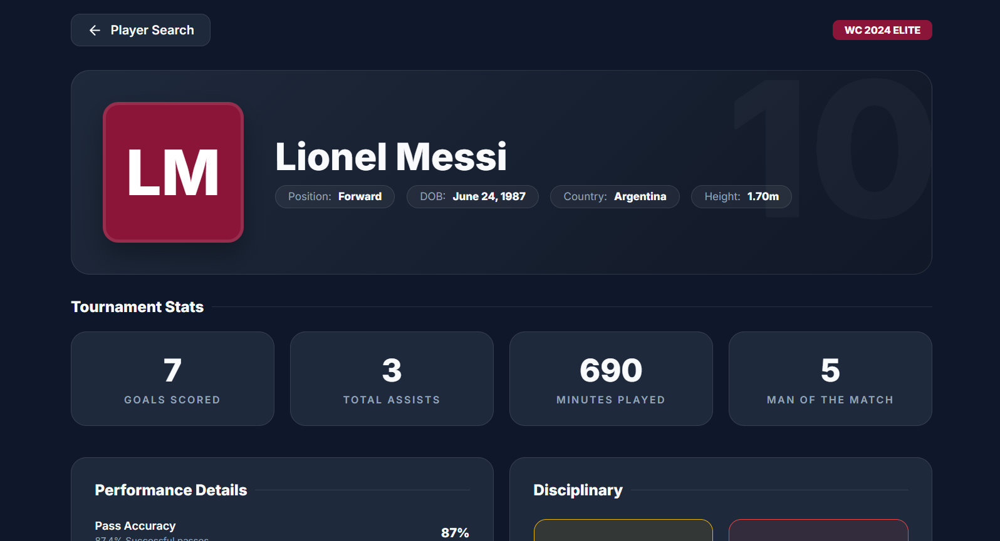
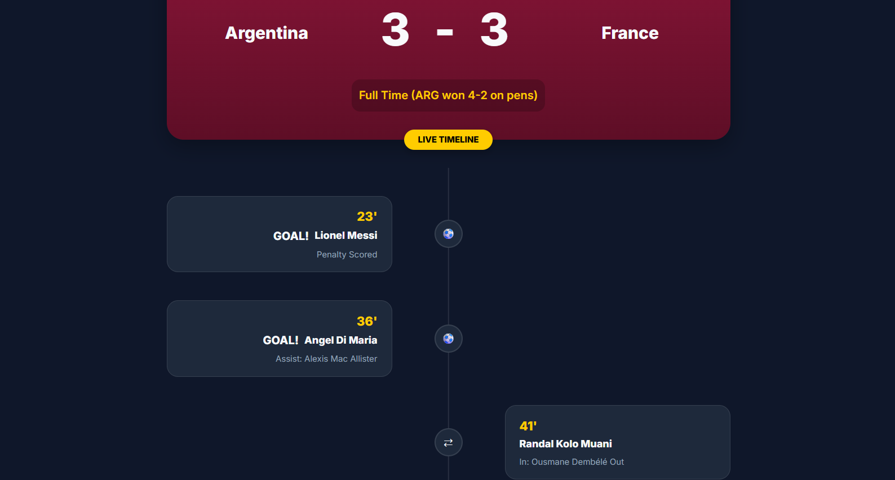
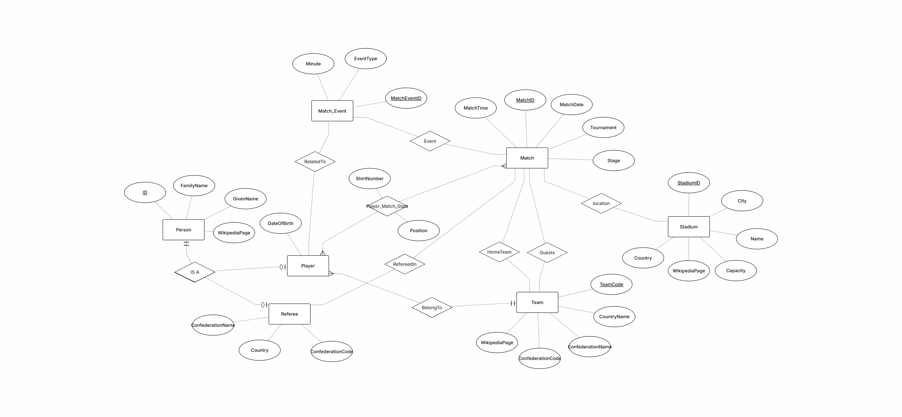
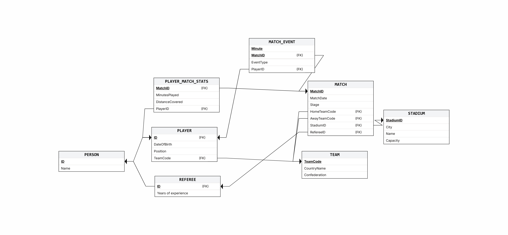

# פרויקט בסיס נתונים: סטטיסטיקות מונדיאל (World Cup Statistics)

**מוגש על ידי:** 
* בנימין אליהו פורקוביץ - 330995135
* איתן דהן - 330824061

**האגף הנבחר:** ניתוח סטטיסטי של משחקים, שחקנים וטורנירים.

---

## תוכן עניינים
1. [הקדמה ומטרת המערכת](#הקדמה-ומטרת-המערכת)
2. [אפיון המערכת (AI Studio)](#אפיון-המערכת-ai-studio)
3. [תרשימי מבנה (ERD & DSD)](#תרשימי-מבנה-erd--dsd)
4. [החלטות עיצוב וארכיטקטורה](#החלטות-עיצוב-וארכיטקטורה)

---

## הקדמה ומטרת המערכת
מערכת זו מיועדת לניתוח הסטטיסטיקות המורכבות סביב משחקי גביע העולם בכדורגל (המונדיאל). הפרויקט עושה שימוש **במאגר נתונים היסטורי ואמיתי** של מונדיאלים בעבר, ומעבד רשומות אותנטיות למבנה רלציוני מנורמל. 

פונקציונליות הליבה של המערכת מתמקדת במעקב אחר משחקים היסטוריים, תיעוד אירועים ספציפיים (שערים, כרטיסים) ברמת הדקה, ואיסוף סטטיסטיקות מדויקות לכל שחקן. המערכת תומכת בשליפת נתונים מורכבת המאפשרת לחקור ולנתח את ביצועי השחקנים והנבחרות על בסיס היסטוריית הכדורגל האמיתית, ולא על ניהול טורנירים עתידיים.

---

## אפיון המערכת (AI Studio)
ממשקי המשתמש הראשוניים ולוחות הבקרה הסטטיסטיים של המערכת אופיינו באמצעות Google AI Studio. 

**קישור לפרויקט ב-AI Studio:** [הכנס כאן את הקישור שלך]

**מסכי המערכת:**





---

## תרשימי מבנה (ERD & DSD)
המבנה הלוגי והפיזי של בסיס הנתונים שלנו, שעוצב במטרה לייעל שליפה ותשאול של נתונים סטטיסטיים.

**תרשים קשר-ישות (ERD):**


**תרשים מבנה נתונים (DSD):**


---

## החלטות עיצוב וארכיטקטורה
במהלך תכנון בסיס הנתונים, קיבלנו מספר החלטות ארכיטקטוניות מרכזיות:
* **ישויות אב/בן (Super-type / Sub-type):** יצרנו טבלת `PERSON` מרכזית המכילה תכונות משותפות (כמו שם ותאריך לידה), ממנה יורשות הטבלאות `PLAYER` (שחקן) ו-`REFEREE` (שופט). עיצוב זה מונע כפילות נתונים ומפשט קיבוץ סטטיסטי.
* **טבלאות מקשרות לאירועים וסטטיסטיקות:** יצרנו טבלאות ייעודיות (`MATCH_EVENT` ו-`PLAYER_MATCH_STATS`) המקושרות גם למשחק וגם לשחקן. דבר זה מאפשר מעקב גרנולרי (פרטני) אחר אירועים ואגרגציות `GROUP BY` יעילות.
* **שילוב נתונים היסטוריים אמיתיים:** התאמנו את הסכמה שלנו כך שתכיל אך ורק מאגרי נתונים מהעולם האמיתי. וידאנו שסוגי הנתונים (Data Types) והאילוצים (Constraints) שלנו תואמים לתרחישים היסטוריים אותנטיים, מבלי לפברק רשומות או לייצר מצבים לא הגיוניים.

  
## Quick Start
Required configuration:

- `DB_USER_SECRET` - PostgreSQL username used by the database container
- `DB_PASSWORD_SECRET` - PostgreSQL password used by the database container
- `DB_NAME_SECRET` - PostgreSQL database name
- `PGADMIN_EMAIL` - login email for pgAdmin
- `PGADMIN_PASSWORD` - login password for pgAdmin
- `ADMIN_CODE` - login password for admin mode

You can copy `.env.example` to `.env` and edit the values before running Docker Compose.

build importer image:
docker compose build importer

1) First-time (start DB + pgAdmin, then run importer):

```bash
docker compose up -d db pgadmin
docker compose --profile import run --rm importer
```

2) If the schema file changed, recreate the DB schema using the mounted file:

```bash
docker compose exec db sh -lc 'psql -U user_db -d world_cup_db -f /stage_1/createTables.sql'
```

3) Troubleshooting / explicit run (bypass image CMD and show script errors directly):

```bash
docker compose --profile import run --rm -T importer python -u stage_1/Programing/generate_data.py
```

Notes:
- The database container only mounts `./stage_1` at `/stage_1`, which is the path used in the schema command above.
- The importer mounts `./stage_1` and `./dataset` so it can read the ETL script and CSV files from the host.

