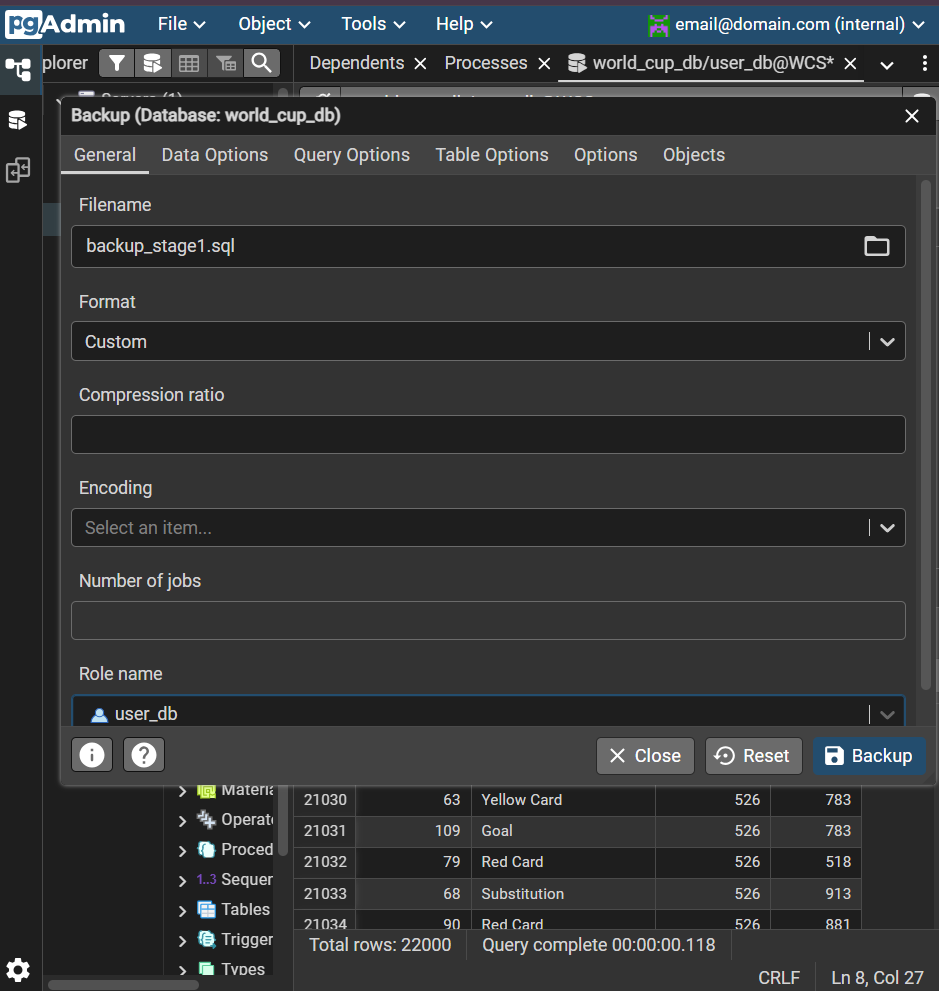
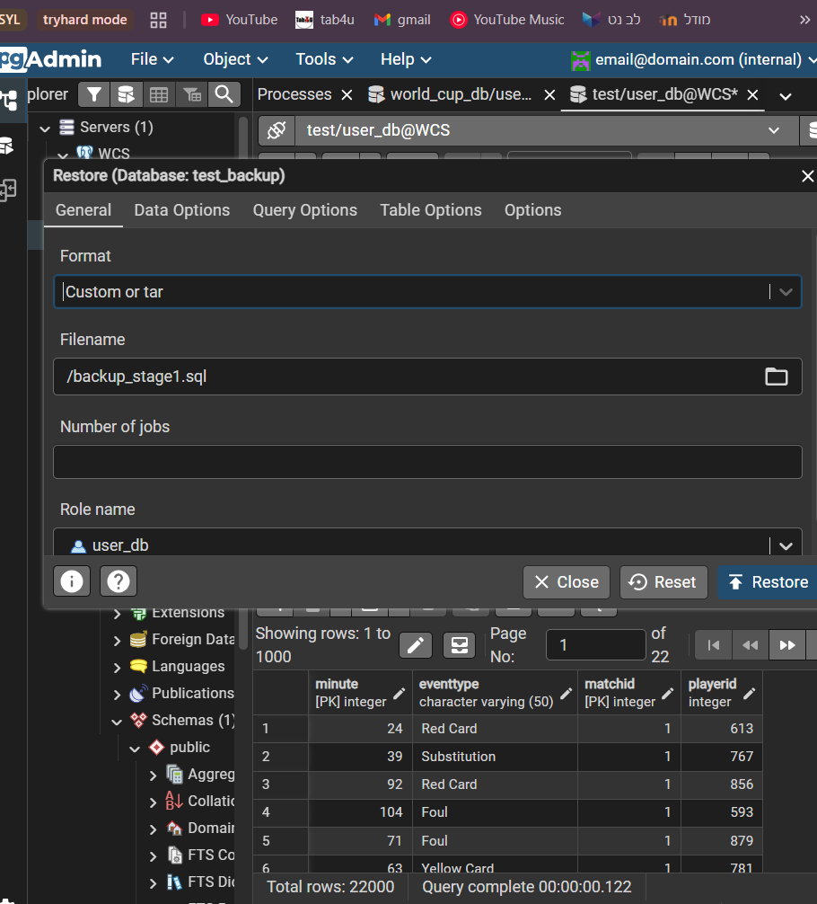
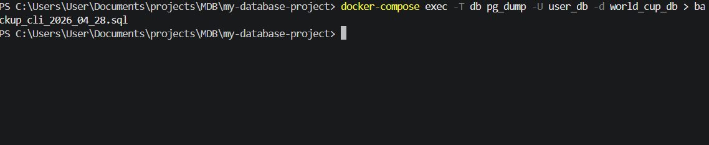

# Database Project: World Cup Statistics (Phase A)

**Submitted by:** 
* Binyamin Eliyahu Forkovich - 330995135
* Eitan Dahan - 330824061

**Selected Unit:** Analysis of matches, players, and tournament statistics.

---

## Table of Contents
1. [Introduction](#introduction)
2. [System Characterization (AI Studio)](#system-characterization-ai-studio)
3. [ERD and DSD Diagrams](#erd-and-dsd-diagrams)
4. [Design Decisions](#design-decisions)
5. [Backup and Restore](#backup-and-restore)

---

## Introduction
This system is designed to analyze the complex statistics surrounding the FIFA World Cup. The project utilizes a **real historical dataset** of past World Cups, processing authentic records into a normalized relational structure. The core functionality focuses on tracking historical matches, documenting specific events (goals, cards) per minute, and collecting precise statistics for each player. The system supports complex data retrieval for analyzing player and team performance based on real-world football history.

---

## System Characterization (AI Studio)
The initial user interfaces and statistical dashboards were characterized using Google AI Studio. 

**Link to the AI Studio project:** [Insert your AI Studio link here]

**System Screens:**

---

## ERD and DSD Diagrams
The logical and physical structures of our database, designed to optimally query statistical data.

**Entity-Relationship Diagram (ERD):**

**Data Structure Diagram (DSD):**

---

## Design Decisions
During the database design phase, we made several key architectural decisions:
* **Super-type / Sub-type Entities:** We created a central `PERSON` table containing shared attributes, from which `PLAYER` and `REFEREE` inherit. This prevents data duplication and simplifies statistical groupings.
* **Association Tables for Events and Stats:** We created dedicated tables (`MATCH_EVENT` and `PLAYER_MATCH_STATS`) linked to both the match and the player, allowing granular event tracking and efficient `GROUP BY` aggregations.
* **Real Historical Data Integration:** We adapted our schema to strictly accommodate real-world datasets, ensuring our data types and constraints match authentic historical scenarios without fabricating records.
* **Cascade Deletion:** We utilized the `CASCADE` constraint in our drop scripts to ensure a safe and efficient teardown of the database environment.

---

## Backup and Restore
We performed a full database backup using two different methods as required:

### Method 1: Graphical User Interface (pgAdmin UI)
A full backup was executed via the pgAdmin interface and successfully restored to a newly created, empty database to verify its integrity.
**Executing the Backup:**

**Executing the Restore:**

### Method 2: Command Line Interface (CLI)
A backup was generated using the `pg_dump` utility directly from within the Docker container to the host machine.
**Running the Backup Command:**

