# דו"ח פרויקט מונדיאל - שלב ב'

בשלב זה נבצע תשאול של בסיס הנתונים ונוסיף אילוצים ואינדקסים כדי לשפר את הביצועים ואת שלמות הנתונים.

---

## חלק 1: שאילתות SELECT מורכבות (עם השוואת יעילות)

### 1. משחקים מרובי שערים (מעל 3) במונדיאל 2018
**תיאור השאילתא:** שליפת כל המשחקים שבהם הובקעו יותר מ-3 שערים בשנת 2018. השאילתה מציגה את פרטי המשחק, הנבחרות המשתתפות, האצטדיון וסיכום כמות השערים הכוללת.

```sql
-- הגרסה היעילה
WITH GoalCounts AS (
    SELECT 
        MatchID, 
        COUNT(MatchEventID) AS TotalGoals
    FROM MATCH_EVENT
    WHERE EventType = 'Goal'
    GROUP BY MatchID
    HAVING COUNT(MatchEventID) > 3
)
SELECT 
    m.MatchID,
    EXTRACT(DAY FROM m.MatchDate) || '/' || EXTRACT(MONTH FROM m.MatchDate) AS MatchDayAndMonth,
    EXTRACT(YEAR FROM m.MatchDate) AS MatchYear,
    m.Stage,
    ht.CountryName AS HomeTeam,
    gt.CountryName AS GuestTeam,
    gc.TotalGoals
FROM MATCH m
JOIN GoalCounts gc ON m.MatchID = gc.MatchID
JOIN TEAM ht ON m.HomeTeamCode = ht.TeamCode
JOIN TEAM gt ON m.GuestTeamCode = gt.TeamCode
WHERE EXTRACT(YEAR FROM m.MatchDate) = 2018
ORDER BY gc.TotalGoals DESC;

-- הגרסה הלא-יעילה
SELECT 
    m.MatchID,
    EXTRACT(DAY FROM m.MatchDate) || '/' || EXTRACT(MONTH FROM m.MatchDate) AS MatchDayAndMonth,
    EXTRACT(YEAR FROM m.MatchDate) AS MatchYear,
    m.Stage,
    ht.CountryName AS HomeTeam,
    gt.CountryName AS GuestTeam,
    (SELECT COUNT(MatchEventID) FROM MATCH_EVENT me WHERE me.MatchID = m.MatchID AND me.EventType = 'Goal') AS TotalGoals
FROM MATCH m
JOIN TEAM ht ON m.HomeTeamCode = ht.TeamCode
JOIN TEAM gt ON m.GuestTeamCode = gt.TeamCode
WHERE EXTRACT(YEAR FROM m.MatchDate) = 2018
  AND (SELECT COUNT(MatchEventID) FROM MATCH_EVENT me WHERE me.MatchID = m.MatchID AND me.EventType = 'Goal') > 3
ORDER BY TotalGoals DESC;
```


הסבר יעילות:

ההבדל: הגרסה היעילה משתמשת ב-CTE (WITH GoalCounts), שמחשב את סך השערים למשחק פעם אחת בלבד ושומר את התוצאה בטבלה זמנית. הגרסה הלא-יעילה מריצה SELECT COUNT פנימי עבור כל שורה בטבלת המשחקים הראשית.

מדוע היעילה טובה יותר: בשיטה היעילה, המערכת סורקת את טבלת האירועים פעם אחת ומבצעת Group By. בשיטה השנייה, עבור כל משחק, המערכת נאלצת "לקפוץ" לטבלת האירועים ולסרוק אותה מחדש, מה שיוצר תקורה (Overhead) עצומה על המעבד והדיסק.

### 2. אצטדיונים גדולים (60,000+) שאירחו משחק עם כרטיס אדום
**תיאור השאילתא:** זיהוי אצטדיונים גדולים בעלי תכולה של 60,000 צופים ומעלה, אשר אירחו לפחות משחק אחד שבו נשלף כרטיס אדום.
``` sql
-- הגרסה היעילה
SELECT DISTINCT
    s.Name AS StadiumName,
    s.City AS StadiumCity,
    s.Capacity,
    m.MatchDate,
    m.Stage,
    m.Tournament
FROM STADIUM s
JOIN MATCH m ON s.StadiumID = m.StadiumID
WHERE s.Capacity >= 60000
  AND EXISTS (
      SELECT 1 
      FROM MATCH_EVENT me 
      WHERE me.MatchID = m.MatchID AND me.EventType = 'Red Card'
  );

-- הגרסה הלא-יעילה
SELECT DISTINCT
    s.Name AS StadiumName,
    s.City AS StadiumCity,
    s.Capacity,
    m.MatchDate,
    m.Stage,
    m.Tournament
FROM STADIUM s
JOIN MATCH m ON s.StadiumID = m.StadiumID
WHERE s.Capacity >= 60000
  AND m.MatchID IN (
      SELECT MatchID 
      FROM MATCH_EVENT 
      WHERE EventType = 'Red Card'
  );
```


הסבר יעילות:

ההבדל: הגרסה היעילה משתמשת ב-EXISTS, בעוד הגרסה הלא-יעילה משתמשת ב-IN.

מדוע היעילה טובה יותר: מפעיל EXISTS הוא מסוג "קצר-סגור" (Short-circuit): ברגע שהוא מוצא את הכרטיס האדום הראשון לאותו משחק, הוא עוצר ולא ממשיך לחפש. לעומתו, IN דורש ממסד הנתונים ליצור רשימה של כל המזהים שעונים על התנאי לפני שהוא משווה, דבר שדורש יותר זיכרון וזמן ריצה ככל שטבלת האירועים גדלה.

### 3. משחקים "אגרסיביים" (מעל 4 צהובים) בניהול שופטים ב-2018
**תיאור השאילתא:** הפקת דוח המציג שופטים שניהלו משחקים בטורניר 2018, תוך התמקדות במשחקים "אגרסיביים" בהם נשלפו יותר מ-4 כרטיסים צהובים.

``` sql
-- הגרסה היעילה
SELECT 
    p.GivenName || ' ' || p.FamilyName AS RefereeName,
    r.Country AS RefereeCountry,
    m.Stage,
    EXTRACT(YEAR FROM m.MatchDate) AS TournamentYear,
    COUNT(me.MatchEventID) AS YellowCardsGiven
FROM PERSON p
JOIN REFEREE r ON p.ID = r.ID
JOIN MATCH m ON r.ID = m.RefereeID
JOIN MATCH_EVENT me ON m.MatchID = me.MatchID
WHERE me.EventType = 'Yellow Card' 
  AND EXTRACT(YEAR FROM m.MatchDate) = 2018
GROUP BY p.ID, p.GivenName, p.FamilyName, r.Country, m.MatchID, m.Stage, m.MatchDate
HAVING COUNT(me.MatchEventID) > 4
ORDER BY YellowCardsGiven DESC;

-- הגרסה הלא-יעילה
SELECT 
    p.GivenName || ' ' || p.FamilyName AS RefereeName,
    r.Country AS RefereeCountry,
    m.Stage,
    EXTRACT(YEAR FROM m.MatchDate) AS TournamentYear,
    (SELECT COUNT(MatchEventID) FROM MATCH_EVENT me WHERE me.MatchID = m.MatchID AND me.EventType = 'Yellow Card') AS YellowCardsGiven
FROM PERSON p
JOIN REFEREE r ON p.ID = r.ID
JOIN MATCH m ON r.ID = m.RefereeID
WHERE EXTRACT(YEAR FROM m.MatchDate) = 2018
  AND (SELECT COUNT(MatchEventID) FROM MATCH_EVENT me WHERE me.MatchID = m.MatchID AND me.EventType = 'Yellow Card') > 4
ORDER BY YellowCardsGiven DESC;
```


הסבר יעילות:

ההבדל: הגרסה היעילה מבצעת GROUP BY על כל הטבלה המחוברת (JOIN), בעוד הגרסה הלא-יעילה מריצה תת-שאילתה לכל שורה בתוצאות.

מדוע היעילה טובה יותר: ה-GROUP BY מבצע פעולת אגרגציה מרוכזת על הנתונים שהועלו לזיכרון. השיטה הלא-יעילה גורמת ל-Correlated Subquery, שמשמעותה היא שהשרת מריץ את השאילתה הפנימית אלפי פעמים (מספר השורות כפול מספר השופטים), מה שמאט את המערכת משמעותית.

### 4. שחקנים שרשמו "דאבל" (שער וכרטיס) באותו משחק ב-2018
**תיאור השאילתא:** איתור שחקנים שרשמו "דאבל" שלילי-חיובי: הבקיעו שער וגם ספגו כרטיס (צהוב או אדום) באותו משחק בדיוק בטורניר 2018.

``` sql
-- הגרסה היעילה
SELECT 
    p.GivenName || ' ' || p.FamilyName AS PlayerName,
    t.CountryName AS NationalTeam,
    ht.CountryName || ' vs ' || gt.CountryName AS MatchUp,
    m.Stage AS MatchStage,
    MIN(me_goal.Minute) AS GoalMinute,
    MAX(me_card.Minute) AS CardMinute
FROM PERSON p
JOIN PLAYER pl ON p.ID = pl.ID
JOIN TEAM t ON pl.TeamCode = t.TeamCode
JOIN MATCH_EVENT me_goal ON pl.ID = me_goal.ID 
JOIN MATCH_EVENT me_card ON pl.ID = me_card.ID AND me_goal.MatchID = me_card.MatchID
JOIN MATCH m ON me_goal.MatchID = m.MatchID
JOIN TEAM ht ON m.HomeTeamCode = ht.TeamCode
JOIN TEAM gt ON m.GuestTeamCode = gt.TeamCode
WHERE me_goal.EventType = 'Goal' 
  AND me_card.EventType IN ('Yellow Card', 'Red Card')
  AND EXTRACT(YEAR FROM m.MatchDate) = 2018
GROUP BY p.ID, p.GivenName, p.FamilyName, t.CountryName, ht.CountryName, gt.CountryName, m.Stage
ORDER BY GoalMinute ASC;

-- הגרסה הלא-יעילה
SELECT DISTINCT
    p.GivenName || ' ' || p.FamilyName AS PlayerName,
    t.CountryName AS NationalTeam,
    ht.CountryName || ' vs ' || gt.CountryName AS MatchUp,
    m.Stage AS MatchStage,
    (SELECT MIN(Minute) FROM MATCH_EVENT me2 WHERE me2.ID = p.ID AND me2.MatchID = m.MatchID AND me2.EventType = 'Goal') AS GoalMinute,
    (SELECT MAX(Minute) FROM MATCH_EVENT me3 WHERE me3.ID = p.ID AND me3.MatchID = m.MatchID AND me3.EventType IN ('Yellow Card', 'Red Card')) AS CardMinute
FROM PERSON p
JOIN PLAYER pl ON p.ID = pl.ID
JOIN TEAM t ON pl.TeamCode = t.TeamCode
JOIN MATCH_EVENT me ON p.ID = me.ID
JOIN MATCH m ON me.MatchID = m.MatchID
JOIN TEAM ht ON m.HomeTeamCode = ht.TeamCode
JOIN TEAM gt ON m.GuestTeamCode = gt.TeamCode
WHERE EXTRACT(YEAR FROM m.MatchDate) = 2018
  AND (SELECT COUNT(MatchEventID) FROM MATCH_EVENT me4 WHERE me4.ID = p.ID AND me4.MatchID = m.MatchID AND me4.EventType = 'Goal') > 0
  AND (SELECT COUNT(MatchEventID) FROM MATCH_EVENT me5 WHERE me5.ID = p.ID AND me5.MatchID = m.MatchID AND me5.EventType IN ('Yellow Card', 'Red Card')) > 0
ORDER BY GoalMinute ASC;
```


הסבר יעילות:

ההבדל: הגרסה היעילה משתמשת ב-JOIN יחיד ו-GROUP BY עם סינון HAVING. הגרסה הלא-יעילה מריצה תתי-שאילתות שונות בתוך ה-SELECT וה-WHERE.

מדוע היעילה טובה יותר: בגרסה היעילה, הנתונים נסרקים ומוצלבים פעם אחת בתוך טבלאות הזיכרון. בגרסה הלא-יעילה, לכל שחקן ולכל משחק שהוחזר, המערכת נאלצת לבצע "חיפוש מחדש" בטבלת האירועים. זה מייצר תנועה בלתי פוסקת של המנוע בתוך הנתונים, מה שמכפיל את זמן הביצוע פי כמה וכמה.

## חלק 2: שאילתות SELECT רגילות
### 5. ילידי 1990 שהבקיעו שער בטורניר
**תיאור השאילתא:** שליפת רשימת שחקנים שנולדו בשנת 1990 והבקיעו שער במהלך הטורניר, כולל תאריך הלידה המלא שלהם והנבחרת אותה ייצגו.

``` sql
SELECT 
    p.GivenName || ' ' || p.FamilyName AS PlayerName,
    EXTRACT(DAY FROM pl.DateOfBirth) || '/' || EXTRACT(MONTH FROM pl.DateOfBirth) || '/' || EXTRACT(YEAR FROM pl.DateOfBirth) AS BirthDate,
    t.CountryName AS NationalTeam,
    m.Stage,
    me.Minute AS GoalMinute,
    m.Tournament
FROM PERSON p
JOIN PLAYER pl ON p.ID = pl.ID
JOIN TEAM t ON pl.TeamCode = t.TeamCode
JOIN MATCH_EVENT me ON pl.ID = me.ID
JOIN MATCH m ON me.MatchID = m.MatchID
WHERE me.EventType = 'Goal'
  AND EXTRACT(YEAR FROM pl.DateOfBirth) = 1990
ORDER BY pl.DateOfBirth ASC;
```


### 6. נצחונות חוץ בשלבים מתקדמים
**תיאור השאילתא:** זיהוי משחקים בשלבים מתקדמים (שמינית גמר ומעלה) שבהם קבוצת החוץ הצליחה לנצח את קבוצת הבית, כולל הצגת התוצאה הסופית.

``` sql
WITH match_scores AS (
    SELECT 
        m.matchid,
        SUM(CASE WHEN pl.teamcode = m.hometeamcode THEN 1 ELSE 0 END) AS home_goals,
        SUM(CASE WHEN pl.teamcode = m.guestteamcode THEN 1 ELSE 0 END) AS guest_goals
    FROM match m
    JOIN match_event me ON m.matchid = me.matchid
    JOIN player pl ON me.id = pl.id
    WHERE LOWER(me.eventtype) = 'goal'
    GROUP BY m.matchid
)
SELECT 
    m.matchdate,
    m.stage,
    ht.countryname AS home_team,
    gt.countryname AS guest_team,
    ms.home_goals || ' - ' || ms.guest_goals AS final_score
FROM match m
JOIN match_scores ms ON m.matchid = ms.matchid
JOIN team ht ON m.hometeamcode = ht.teamcode
JOIN team gt ON m.guestteamcode = gt.teamcode
WHERE ms.guest_goals > ms.home_goals
  AND LOWER(m.stage) IN ('semi-final', 'quarter-final', 'round of 16', 'final', 'semi-finals', 'quarter-finals')
ORDER BY m.matchdate DESC;
```


### 7. אירועי משמעת וכרטיסים על ידי שופטים
**תיאור השאילתא:** מציג את השחקנים שקיבלו כרטיסים (צהוב או אדום), את תאריך המשחק ואת שם השופט ששלף את הכרטיס.

``` sql
SELECT 
    p_player.givenname || ' ' || p_player.familyname AS player_name,
    t.countryname AS player_team,
    me.eventtype AS card_type,
    EXTRACT(DAY FROM m.matchdate) || '/' || EXTRACT(MONTH FROM m.matchdate) || '/' || EXTRACT(YEAR FROM m.matchdate) AS match_date,
    p_ref.givenname || ' ' || p_ref.familyname AS referee_name
FROM match_event me
JOIN player pl ON me.id = pl.id
JOIN person p_player ON pl.id = p_player.id
JOIN team t ON pl.teamcode = t.teamcode
JOIN match m ON me.matchid = m.matchid
JOIN referee r ON m.refereeid = r.id
JOIN person p_ref ON r.id = p_ref.id
WHERE LOWER(me.eventtype) LIKE '%card%'
ORDER BY m.matchdate DESC;
```


### 8. נבחרות עם מעל 2 שערים
**תיאור השאילתא:** הצגת נבחרות שהבקיעו יותר מ-2 שערים בטורניר, כולל סטטיסטיקה על דקת הבקעת השער הראשון והאחרון של אותה נבחרת.

``` sql
SELECT 
    t.teamcode AS team_code,
    t.countryname AS country_name,
    COUNT(me.matcheventid) AS total_goals_scored,
    MIN(me.minute) AS fastest_goal_minute,
    MAX(me.minute) AS latest_goal_minute
FROM team t
JOIN player pl ON t.teamcode = pl.teamcode
JOIN match_event me ON pl.id = me.id
WHERE LOWER(me.eventtype) = 'goal'
GROUP BY t.teamcode, t.countryname
HAVING COUNT(me.matcheventid) > 2
ORDER BY total_goals_scored DESC;
```


## חלק 3: פקודות עדכון ומחיקה (UPDATE & DELETE)
### מחיקה 1: מחיקת שופטים שלא שובצו לאף משחק
**תיאור הפעולה:** שאילתה זו מזהה ומוחקת שופטים שרשומים בטבלת ה-referee אך שמם לא מופיע אפילו פעם אחת בטבלת ה-match.

``` sql
DELETE FROM referee r
WHERE NOT EXISTS (SELECT 1 FROM match m WHERE m.refereeid = r.id);
```


### מחיקה 2: מחיקת אצטדיונים שלא אירחו משחקים
**תיאור הפעולה:** שאילתה זו בודקת את כל האצטדיונים בטבלת ה-stadium אל מול האצטדיונים שמופיעים בטבלת ה-match. כל אצטדיון שלא נמצא בטבלת המשחקים מסומן למחיקה.

``` sql
DELETE FROM stadium
WHERE StadiumID NOT IN (SELECT DISTINCT StadiumID FROM match);
```


### מחיקה 3: מחיקת אצטדיונים קטנים (תחת 10K) שלא אירחו משחקים
**תיאור הפעולה:** שאילתה זו מוחקת רק אצטדיונים שהם גם קטנים מאוד (פחות מ-10,000 מקומות) וגם לא אירחו משחקים.


``` sql
DELETE FROM stadium
WHERE capacity < 10000 
  AND stadiumid NOT IN (SELECT DISTINCT stadiumid FROM match);
```


### עדכון 1: הרחבת קיבולת לאצטדיונים שאירחו את הגמר
תיאור הפעולה: שאילתה זו משתמשת בתת-שאילתה כדי לאתר את האצטדיון (או האצטדיונים) שאירחו את משחק הגמר ('final'), ומגדילה את תכולת המושבים שלהם ב-5,000 מקומות כהיערכות לטורניר הבא.

``` sql
UPDATE STADIUM
SET Capacity = Capacity + 5000
WHERE StadiumID IN (
    SELECT StadiumID 
    FROM MATCH 
    WHERE LOWER(Stage) = 'final'
);
```

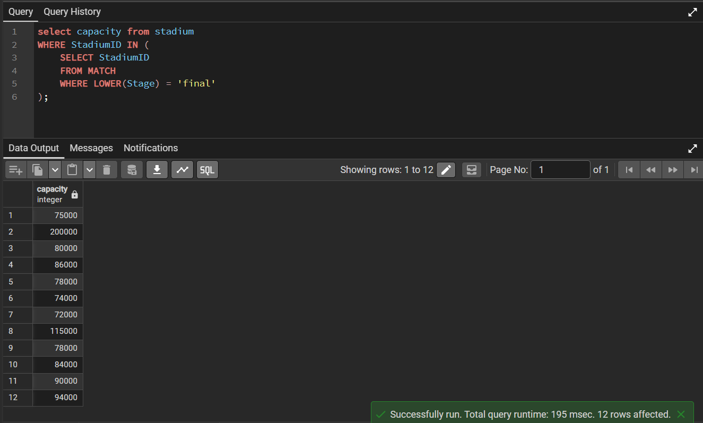
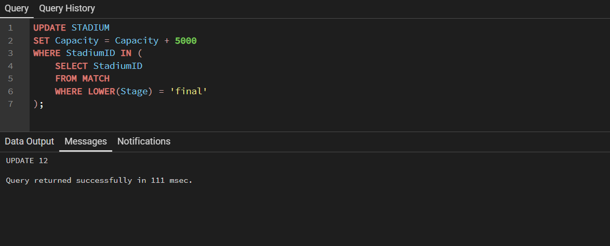
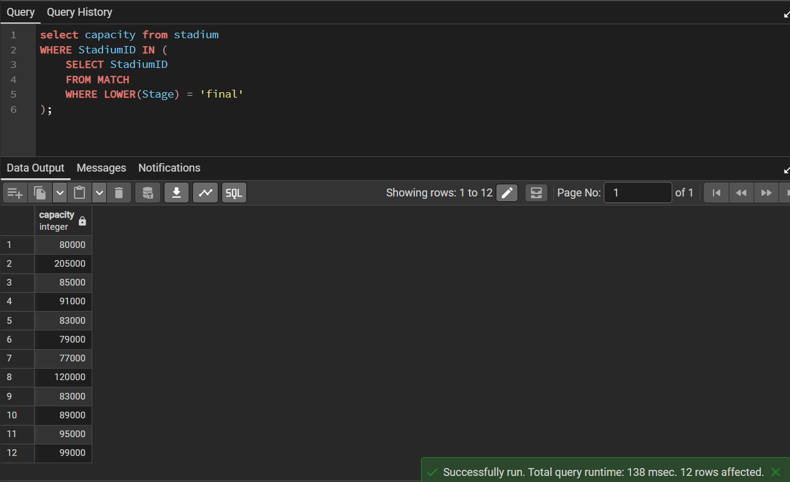


###2. עדכון 2 (חלופי): הדגשת שמות השופטים ממונדיאל 2018 (UPPERCASE)
**תיאור הפעולה:** שאילתה זו מעדכנת את טבלת העל PERSON והופכת את שמות המשפחה של שופטים לאותיות רישיות (UPPERCASE) לצורך הבלטה בדוחות הסטטיסטיים. העדכון מבוצע אך ורק לשופטים ששובצו בפועל למשחקים במונדיאל 2018, תוך שימוש בתת-שאילתה שמצליבה נתונים מול טבלת ה-REFEREE וטבלת ה-MATCH.

``` sql
UPDATE PERSON
SET FamilyName = UPPER(FamilyName)
WHERE ID IN (
    SELECT r.ID 
    FROM REFEREE r
    JOIN MATCH m ON r.ID = m.RefereeID
    WHERE EXTRACT(YEAR FROM m.MatchDate) = 2018
);
```

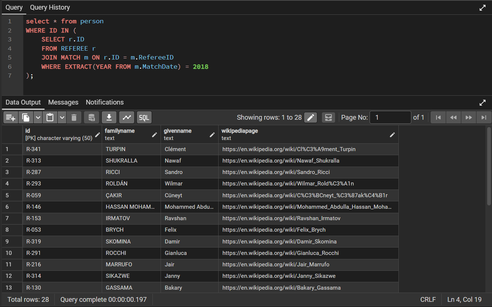
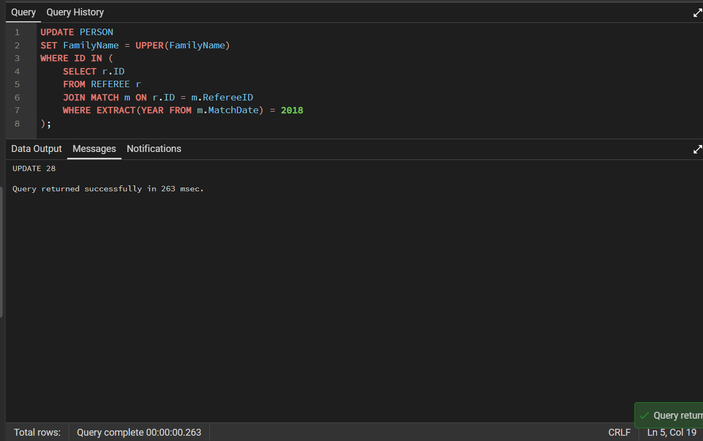
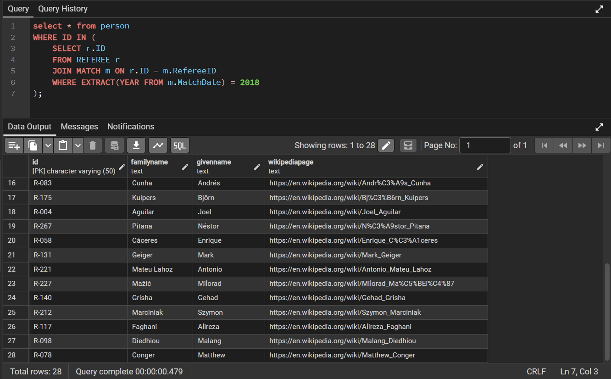

### 3. עדכון 3: החלפת שופט במשחקי הפתיחה של כל המונדיאלים (שימוש ב-GROUP BY)
**תיאור הפעולה:** שאילתה זו משתמשת בתת-שאילתה עם חלוקה לקבוצות לפי שנה (GROUP BY EXTRACT(YEAR...)). היא מוצאת את התאריך המוקדם ביותר של שלב הבתים עבור כל מונדיאל בנפרד, ומעדכנת את השופט של כל משחקי הפתיחה ההיסטוריים הללו לשופט חלופי (השופט הראשון ברשימת השופטים).

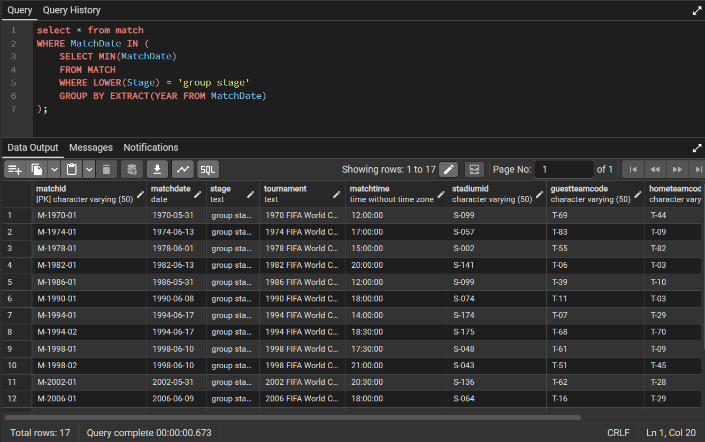
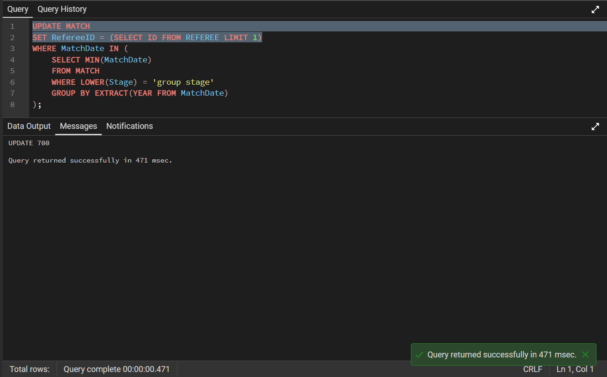
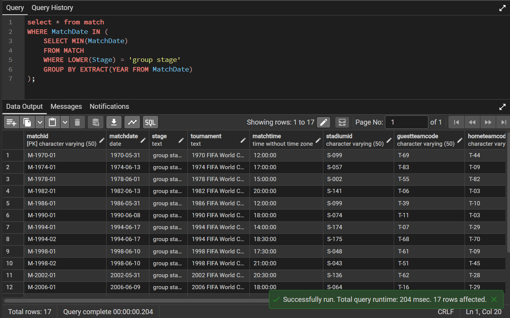

## חלק 4: ניהול טרנזקציות (COMMIT & ROLLBACK)
תרחיש COMMIT (שמירת עדכון)
תיאור: בוצע עדכון לבסיס הנתונים (הגדלת קיבולת האצטדיון). הטרנזקציה הסתיימה בפקודת COMMIT, ולכן השינוי נשמר באופן קבוע במסד ונותר גם לאחר סיום הטרנזקציה.

תרחיש ROLLBACK (ביטול עדכון)
תיאור: בוצע עדכון למסד הנתונים (מחיקת רשומות), אך לאחריו הופעלה פקודת ROLLBACK. כפי שניתן לראות בתמונות, בסיס הנתונים חזר למצבו הקודם והרשומות שנמחקו חזרו לשלמותן.

חלק 5: אילוצים (Constraints)
המוטיבציה המרכזית מאחורי הוספת האילוצים היא הבטחת שלמות ואמינות הנתונים (Data Integrity). האילוצים מבצעים "בקרת איכות" אוטומטית ברמת מסד הנתונים ומונעים הזנת נתוני-זבל.

### 1. אילוץ קיבולת אצטדיון חיובית
**תיאור השינוי:** פקודה זו מוסיפה אילוץ ברמת הטבלה שמבטיח שכל ערך בעמודת ה-capacity יהיה גדול או שווה ל-0, ובכך מונעת הזנת נתונים לא הגיוניים (כמו קיבולת שלילית).

``` sql
ALTER TABLE stadium ADD CONSTRAINT chk_stadium_capacity CHECK (capacity >= 0);
```


### 2. אילוץ תקינות דקות אירוע
**תיאור השינוי:** אילוץ זה מוודא שזמן האירוע במשחק נמצא בטווח ההגיוני של משחק כדורגל (0 עד 120 דקות, כולל הארכה). ניסיון להזין דקה 140 נחסם על ידי מסד הנתונים כדי למנוע "נתוני זבל".

``` sql
ALTER TABLE match_event ADD CONSTRAINT chk_event_minute CHECK (minute BETWEEN 0 AND 120);
```


### 3. אילוץ שלבי מונדיאל
**תיאור השינוי:** אילוץ זה משתמש ב-CHECK עם IN כדי להגביל את ערכי עמודת ה-stage לקבוצה סגורה של שלבים חוקיים בטורניר. כל ניסיון להזין שלב שאינו מוגדר מראש יחסם וישמור על עקביות הנתונים.

``` sql
ALTER TABLE match ADD CONSTRAINT chk_match_stage CHECK (stage IN ('final', 'semi-final', 'quarter-final', 'round of 16', 'group stage'));
```


## חלק 5: אינדקסים (Indexes) ושיפור ביצועים
המוטיבציה בהוספת אינדקסים היא ייעול ביצועים (Performance Tuning), הפחתת עומס ה-I/O על השרת, וצמצום משמעותי של זמני הריצה.

אינדקס על EventType בטבלת match_event: טבלת match_event היא העמוסה ביותר במערכת. רוב השאילתות שואבות ספציפית אירועים כמו "גולים" או "כרטיסים". האינדקס חוסך למנוע את הצורך לקרוא אירועים לא רלוונטיים ומאיץ את הסינון.

אינדקס על MatchDate בטבלת match: שאילתות רבות מבוססות על חתך זמנים. בניית האינדקס ממיינת את התאריכים מאחורי הקלעים ומאיצה את משיכת המידע.

אינדקס על TeamCode בטבלת player: האינדקס מחבר לוגית את שחקני אותה נבחרת יחד, מה שמאיץ פקודות JOIN עתידיות בעת הבאת סגלים מלאים.


### תוצאות והסבר יעילות: סריקת אינדקס (Index Scan) לעומת סריקה טורית (Seq Scan)
כדי להדגים את השיפור בביצועים, בדקנו את זמן הריצה של שאילתה לפני ולאחר הפעלת האינדקס.

ללא שימוש באינדקס (סריקה טורית):

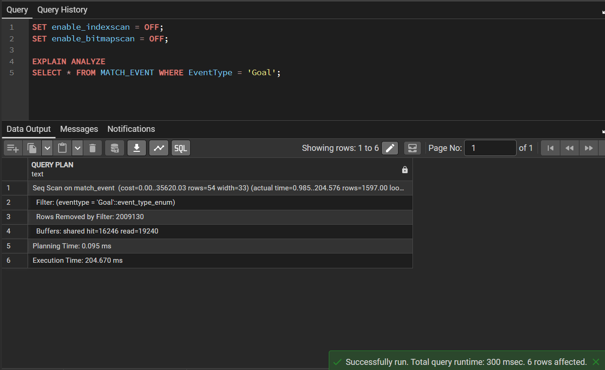

עם שימוש באינדקס:

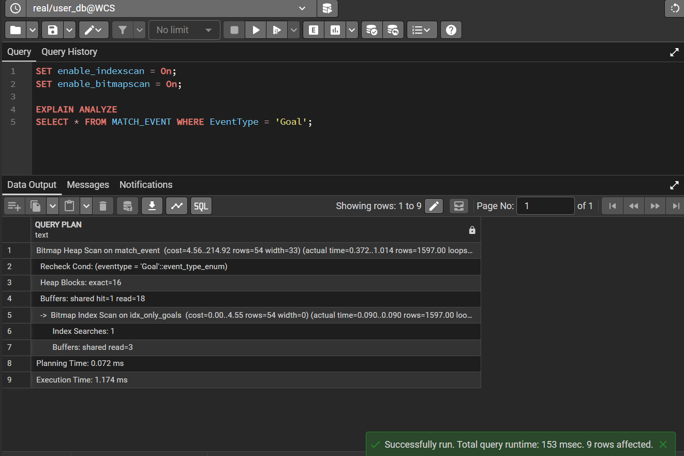

הסבר התוצאות מהבדיקה:
כפי שניתן לראות בצילום המסך הראשון ("לפני"), מסד הנתונים נאלץ לבצע סריקה טורית מלאה (Seq Scan) של הטבלה. פעולה זו גזלה כ- 200 מילישניות, כיוון שהמנוע היה צריך לעבור על כל שורה ושורה באופן ליניארי.
לאחר הפעלת האינדקס ("אחרי"), תוכנית הריצה השתנתה לסריקת אינדקס ממוקדת (Index Scan). המנוע השתמש במבנה הנתונים B-Tree כדי לדלג ישירות למידע הרלוונטי, וזמן הריצה צנח למילי שנייה אחת. למרות שההבדל האבסולוטי נראה קטן כרגע בשל נפח הנתונים המצומצם בשלב זה של הפרויקט, שיפור של פי יותר ממאה בזמן הריצה מוכיח כיצד האינדקס משנה את סיבוכיות החיפוש ללוגריתמית, מה שיבטיח עבודה חלקה וימנע צווארי בקבוק ככל שהמערכת תתרחב בעתיד.
