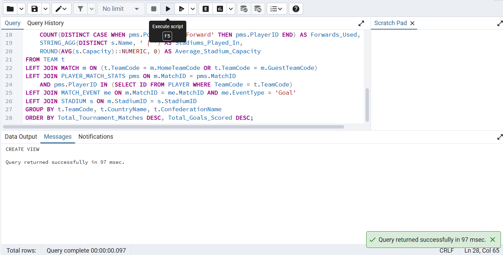
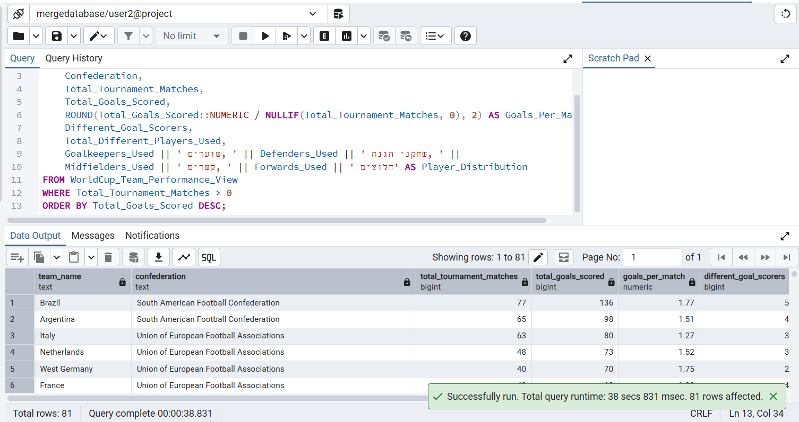
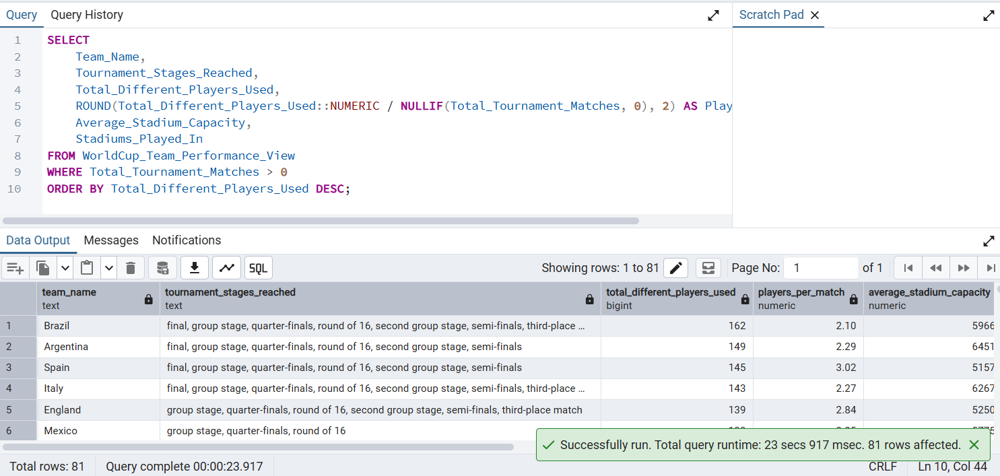
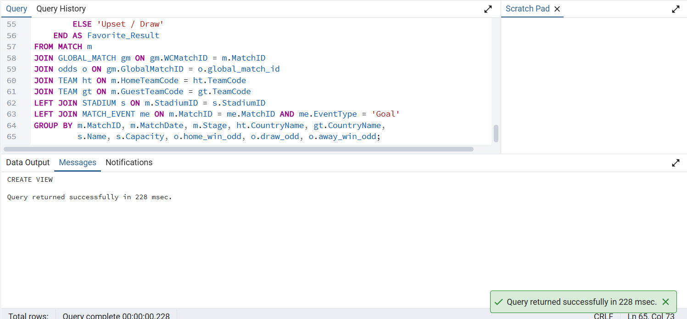
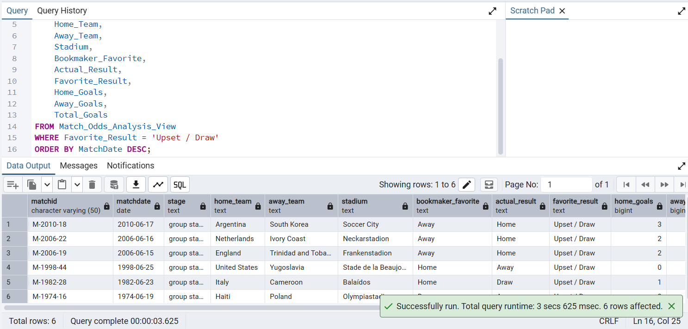
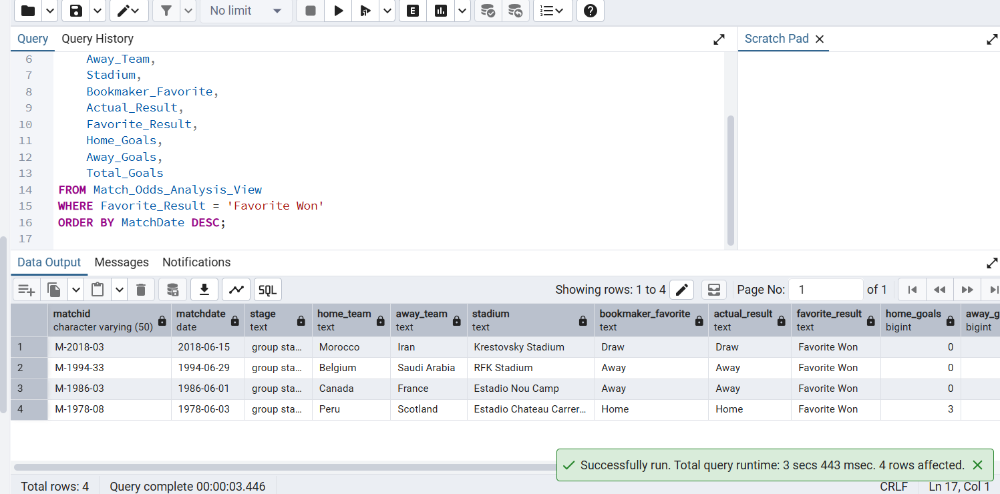

# דו"ח פרויקט - שלב ג': אינטגרציה ומבטים
פרק זה מתעד את תהליך מיזוג בסיס הנתונים הסטטיסטי של המונדיאל עם בסיס נתונים של מערכת הימורי ספורט שקיבלנו מזוג אחר. המטרה: יצירת מערכת מאוחדת המאפשרת ניהול משחקים וביצוע הימורים תחת קורת גג ארכיטקטונית אחת, ללא אובדן נתונים היסטוריים.

## 1. אלגוריתם הינדוס לאחור (Reverse Engineering)
על מנת ללמוד את מבנה מערכת ההימורים ולשלב אותה במערכת שלנו, פעלנו בשיטת הינדוס לאחור (Reverse Engineering) במספר שלבים עוקבים:

### שלב א': הקמת סביבה חיה ובחינת הסכמה הפיזית
קיבלנו מהאגף השני קובץ גיבוי (Backup.sql) והחלטנו לייבא אותו אל תוך בסיס נתונים פעיל בסביבת הפיתוח שלנו. המטרה הייתה לראות את הטבלאות "באוויר" במקום רק לקרוא קוד יבש. סקרנו את הטבלאות שנוצרו (users, bets, odds, matches וכו'), וחילצנו מתוכן את כל השדות, סוגי הנתונים (Data Types) והגדרות המפתחות הראשיים (PK).

### שלב ב': שרטוט מודל מבנה הנתונים (DSD)
על בסיס השדות שחילצנו, יצרנו את תרשים ה-DSD אשר משקף את הארכיטקטורה הפיזית של בסיס הנתונים. במקומות בהם הגיבוי שקיבלנו היה חסר (למשל, אילוצי מפתח זר - FK שלא הוגדרו במפורש ברמת ה-SQL), ביצענו "השלמות לוגיות" על בסיס היגיון בריא. הסקנו מתוך שמות העמודות (כמו user_id או match_id) אילו טבלאות תלויות אחת בשנייה כדי להשלים את תמונת המבנה הפיזי החסרה.

### שלב ג': הפשטה מודלית ותרגום ל-ERD
לאחר שהיה בידינו ה-DSD הפיזי, עלינו רמה אחת למעלה אל המודל המושגי. עברנו על כל טבלה ושאלנו "מה הישות הזו מייצגת בעולם האמיתי?".
זיהינו אילו טבלאות הן ישויות עצמאיות (למשל: 'משתמש', 'קבוצה'), ואילו הן טבלאות קשר או תנועה (למשל: 'הימור', שמקשר בין משתמש למשחק). את קשרי הגומלין (Relationships) בתרשים ה-ERD ביססנו על הלוגיקה העסקית של המערכת: הסקנו למשל שלמשתמש אחד יכולים להיות מספר הימורים (יחס 1:N), ושמשחק חייב להכיל יחסי זכייה מוגדרים. המעבר מהפיזי ללוגי נתן לנו את ההבנה העמוקה שנדרשה לקראת שלב האינטגרציה.


## 2. החלטות אדריכליות בשלב האינטגרציה
האתגר (ההתנגשות): שתי המערכות הכילו ישות של "משחק" (MATCH במונדיאל מול matches בהימורים). מכיוון שמערכת המונדיאל מכילה משחקים היסטוריים בעוד מערכת ההימורים מכילה משחקים שוטפים נפרדים, יצירת קשר ישיר (1:1) הייתה מאלצת מחיקת נתונים או יצירת כפילויות.

הפתרון - מודל ישות-על (Super-type): החלטנו ליישם ארכיטקטורה של מיפוי מרכזי. במקום לחבר את הטבלאות ישירות, יצרנו צומת מרכזי בדמות טבלה חדשה בשם GLOBAL_MATCH.

איך זה עובד: כל משחק מונדיאל וכל משחק הימורים קיבל "תעודת זהות" גלובלית בטבלה זו.

הקצאת קשרים בלעדית: טבלאות המערכת הפיננסית (bets ו-odds) נותקו מטבלת המשחקים המקורית שלהן, חוברו ישירות ל-GLOBAL_MATCH, והוחל עליהן אילוץ NOT NULL.

היתרון: ארכיטקטורה זו שומרת על שלמות הנתונים (Data Integrity), מונעת אנומליות, ומאפשרת למערכת לגדול ולקלוט בעתיד ענפי ספורט נוספים דרך אותו צומת.


## 3. תהליך הסבת הנתונים (Data Migration)
מכיוון שהאינטגרציה יצרה חיבור מבני חדש, נוצר נתק היסטורי: אף הימור במערכת המקורית לא הצביע על משחק מונדיאל. כדי להפיח חיים במערכת ולהדגים יכולות שליפה אינטגרטיביות, ביצענו תהליך צימוד (Pairing) מבוקר.

השתמשנו בטבלאות זמניות בזיכרון (CTEs) ובפונקציית החלוקה ROW_NUMBER().

בודדנו 10 משחקי מונדיאל אקראיים והמרנו 10 משחקים עם אותו מספר סידורי שיצביעו על משחקי המונדיאל במקום על המשחקים השמורים במסד הנתונים של ההימורים

## 4. מבטים ושאילתות מורכבות (Views)
כדי לייעל את תהליך תשאול הנתונים ולספק ניתוחי עומק, פיתחנו שני מבטים מורכבים המשלבים מספר רב של טבלאות לטובת הסתרת מורכבות ה-JOIN ממשתמש הקצה וביצוע אגרגציות מתקדמות.

### מבט 1: WorldCup_Team_Performance_View (ניתוח ביצועי הנבחרות)
#### תיאור המבט:
- מבט זה משלב 5 טבלאות מרכזיות: TEAM, MATCH, PLAYER_MATCH_STATS, MATCH_EVENT, ו-STADIUM.
- הוא בוחן את ביצועי הנבחרת מנקודת המבט של הטורניר: סופר את מספר המשחקים של כל נבחרת, מזהה שחקני מפתח, ומחשב סך שערים.
- המבט מחשב את התפלגות השחקנים לפי עמדות (שוערים, הגנה, קשרים, חלוצים) ומציג את ממוצע תכולת האצטדיונים שבהם הנבחרת שיחקה.
- תועלת: הצגת מבנה הנבחרת והדינמיקה שלה בכל שלב בטורניר.

```sql
CREATE OR REPLACE VIEW WorldCup_Team_Performance_View AS
SELECT 
    t.TeamCode,
    t.CountryName AS Team_Name,
    t.ConfederationName AS Confederation,
    COUNT(DISTINCT m.MatchID) AS Total_Tournament_Matches,
    STRING_AGG(DISTINCT m.Stage, ', ') AS Tournament_Stages_Reached,
    COUNT(DISTINCT CASE WHEN me.EventType = 'Goal' AND me.ID IN 
        (SELECT ID FROM PLAYER WHERE TeamCode = t.TeamCode) 
        THEN me.MatchEventID END) AS Total_Goals_Scored,
    COUNT(DISTINCT CASE WHEN me.EventType = 'Goal' AND me.ID IN 
        (SELECT ID FROM PLAYER WHERE TeamCode = t.TeamCode) 
        THEN me.ID END) AS Different_Goal_Scorers,
    COUNT(DISTINCT pms.PlayerID) AS Total_Different_Players_Used,
    COUNT(DISTINCT CASE WHEN pms.Position = 'Goalkeeper' THEN pms.PlayerID END) AS Goalkeepers_Used,
    COUNT(DISTINCT CASE WHEN pms.Position = 'Defender' THEN pms.PlayerID END) AS Defenders_Used,
    COUNT(DISTINCT CASE WHEN pms.Position = 'Midfielder' THEN pms.PlayerID END) AS Midfielders_Used,
    COUNT(DISTINCT CASE WHEN pms.Position = 'Forward' THEN pms.PlayerID END) AS Forwards_Used,
    STRING_AGG(DISTINCT s.Name, ' | ') AS Stadiums_Played_In,
    ROUND(AVG(s.Capacity)::NUMERIC, 0) AS Average_Stadium_Capacity
FROM TEAM t
LEFT JOIN MATCH m ON (t.TeamCode = m.HomeTeamCode OR t.TeamCode = m.GuestTeamCode)
LEFT JOIN PLAYER_MATCH_STATS pms ON m.MatchID = pms.MatchID 
    AND pms.PlayerID IN (SELECT ID FROM PLAYER WHERE TeamCode = t.TeamCode)
LEFT JOIN MATCH_EVENT me ON m.MatchID = me.MatchID AND me.EventType = 'Goal'
LEFT JOIN STADIUM s ON m.StadiumID = s.StadiumID
GROUP BY t.TeamCode, t.CountryName, t.ConfederationName
ORDER BY Total_Tournament_Matches DESC, Total_Goals_Scored DESC;
```


#### שאילתה 1.1: הנבחרות המובילות בטורניר עם סטטיסטיקות שחקנים
תיאור: שליפת הנבחרות ששיחקו לפחות משחק אחד, ממוינות לפי כמות השערים שהבקיעו בסדר יורד, תוך חישוב ממוצע שערים למשחק והצגת התפלגות השחקנים שהשתתפו לפי עמדה על המגרש.

```SQL
SELECT 
    Team_Name, 
    Confederation,
    Total_Tournament_Matches,
    Total_Goals_Scored,
    ROUND(Total_Goals_Scored::NUMERIC / NULLIF(Total_Tournament_Matches, 0), 2) AS Goals_Per_Match,
    Different_Goal_Scorers,
    Total_Different_Players_Used,
    Goalkeepers_Used || ' שוערים, ' || Defenders_Used || ' שחקני הגנה, ' || 
    Midfielders_Used || ' קשרים, ' || Forwards_Used || ' חלוצים' AS Player_Distribution
FROM WorldCup_Team_Performance_View
WHERE Total_Tournament_Matches > 0
ORDER BY Total_Goals_Scored DESC;
```


#### שאילתה 1.2: ניתוח רוטציית שחקנים ושימוש באצטדיונים
תיאור: מציגה את הנבחרות לפי רמת סבב (רוטציית) השחקנים שלהן, מחשבת כמה שחקנים שונים שותפו בממוצע למשחק, ומציגה את האצטדיונים שבהם הנבחרת שיחקה.


```SQL
SELECT 
    Team_Name,
    Tournament_Stages_Reached,
    Total_Different_Players_Used,
    ROUND(Total_Different_Players_Used::NUMERIC / NULLIF(Total_Tournament_Matches, 0), 2) AS Players_Per_Match,
    Average_Stadium_Capacity,
    Stadiums_Played_In
FROM WorldCup_Team_Performance_View
WHERE Total_Tournament_Matches > 0
ORDER BY Total_Different_Players_Used DESC;
```


### מבט 2: Match_Odds_Analysis_View (ניתוח דיוק יחסי הזכייה מול תוצאות אמת)
#### תיאור המבט:
- מבט זה משלב את הטבלאות MATCH, GLOBAL_MATCH, odds, TEAM, STADIUM, ו-MATCH_EVENT.
- הוא מאפשר ניתוח של דיוק תחזיות ה-odds (יחסי הזכייה) מול התוצאות בפועל שקרו על המגרש, ללא תלות בטבלת המשתמשים או ההימורים האישיים.
- המבט מחשב את כמות השערים לכל קבוצה, קובע מי הייתה הפייבוריטית של סוכנויות ההימורים, מי ניצחה בפועל, ומסמן האם התרחשה הפתעה (Upset) או שהתוצאה הייתה צפויה.

```sql
CREATE OR REPLACE VIEW Match_Odds_Analysis_View AS
SELECT
    m.MatchID,
    m.MatchDate,
    m.Stage,
    ht.CountryName AS Home_Team,
    gt.CountryName AS Away_Team,
    s.Name AS Stadium,
    s.Capacity AS Stadium_Capacity,
    o.home_win_odd,
    o.draw_odd,
    o.away_win_odd,
    SUM(CASE WHEN me.EventType = 'Goal' AND me.ID IN 
        (SELECT ID FROM PLAYER WHERE TeamCode = m.HomeTeamCode) THEN 1 ELSE 0 END) AS Home_Goals,
    SUM(CASE WHEN me.EventType = 'Goal' AND me.ID IN 
        (SELECT ID FROM PLAYER WHERE TeamCode = m.GuestTeamCode) THEN 1 ELSE 0 END) AS Away_Goals,
    SUM(CASE WHEN me.EventType = 'Goal' THEN 1 ELSE 0 END) AS Total_Goals,
    CASE 
        WHEN o.home_win_odd < o.draw_odd AND o.home_win_odd < o.away_win_odd THEN 'Home'
        WHEN o.draw_odd < o.home_win_odd AND o.draw_odd < o.away_win_odd THEN 'Draw'
        ELSE 'Away'
    END AS Bookmaker_Favorite,
    CASE 
        WHEN SUM(CASE WHEN me.EventType = 'Goal' AND me.ID IN 
            (SELECT ID FROM PLAYER WHERE TeamCode = m.HomeTeamCode) THEN 1 ELSE 0 END) > 
             SUM(CASE WHEN me.EventType = 'Goal' AND me.ID IN 
            (SELECT ID FROM PLAYER WHERE TeamCode = m.GuestTeamCode) THEN 1 ELSE 0 END)
        THEN 'Home'
        WHEN SUM(CASE WHEN me.EventType = 'Goal' AND me.ID IN 
            (SELECT ID FROM PLAYER WHERE TeamCode = m.HomeTeamCode) THEN 1 ELSE 0 END) = 
             SUM(CASE WHEN me.EventType = 'Goal' AND me.ID IN 
            (SELECT ID FROM PLAYER WHERE TeamCode = m.GuestTeamCode) THEN 1 ELSE 0 END)
        THEN 'Draw'
        ELSE 'Away'
    END AS Actual_Result,
    CASE 
        WHEN o.home_win_odd < o.draw_odd AND o.home_win_odd < o.away_win_odd AND 
             SUM(CASE WHEN me.EventType = 'Goal' AND me.ID IN 
            (SELECT ID FROM PLAYER WHERE TeamCode = m.HomeTeamCode) THEN 1 ELSE 0 END) > 
             SUM(CASE WHEN me.EventType = 'Goal' AND me.ID IN 
            (SELECT ID FROM PLAYER WHERE TeamCode = m.GuestTeamCode) THEN 1 ELSE 0 END)
        THEN 'Favorite Won'
        WHEN o.draw_odd < o.home_win_odd AND o.draw_odd < o.away_win_odd AND 
             SUM(CASE WHEN me.EventType = 'Goal' AND me.ID IN 
            (SELECT ID FROM PLAYER WHERE TeamCode = m.HomeTeamCode) THEN 1 ELSE 0 END) = 
             SUM(CASE WHEN me.EventType = 'Goal' AND me.ID IN 
            (SELECT ID FROM PLAYER WHERE TeamCode = m.GuestTeamCode) THEN 1 ELSE 0 END)
        THEN 'Favorite Won'
        WHEN o.away_win_odd < o.home_win_odd AND o.away_win_odd < o.draw_odd AND 
             SUM(CASE WHEN me.EventType = 'Goal' AND me.ID IN 
            (SELECT ID FROM PLAYER WHERE TeamCode = m.GuestTeamCode) THEN 1 ELSE 0 END) > 
             SUM(CASE WHEN me.EventType = 'Goal' AND me.ID IN 
            (SELECT ID FROM PLAYER WHERE TeamCode = m.HomeTeamCode) THEN 1 ELSE 0 END)
        THEN 'Favorite Won'
        ELSE 'Upset / Draw'
    END AS Favorite_Result
FROM MATCH m
JOIN GLOBAL_MATCH gm ON gm.WCMatchID = m.MatchID
JOIN odds o ON gm.GlobalMatchID = o.global_match_id
JOIN TEAM ht ON m.HomeTeamCode = ht.TeamCode
JOIN TEAM gt ON m.GuestTeamCode = gt.TeamCode
LEFT JOIN STADIUM s ON m.StadiumID = s.StadiumID
LEFT JOIN MATCH_EVENT me ON m.MatchID = me.MatchID AND me.EventType = 'Goal'
GROUP BY m.MatchID, m.MatchDate, m.Stage, ht.CountryName, gt.CountryName, 
         s.Name, s.Capacity, o.home_win_odd, o.draw_odd, o.away_win_odd;
```

שאילתה 1: פרופיל מהמרים מובילים

תיאור: שליפת משתמשים שהשקיעו מעל 50 יחידות מטבע במשחק מונדיאל יחיד, מסודרים בסדר יורד של סכום ההימור כדי לזהות לקוחות VIP.

#### שאילתה 2.1: זיהוי הפתעות בטורניר (Upsets)
תיאור: שליפת כל המשחקים שבהם התוצאה בפועל סתרה את תחזיות ה-odds (למשל, האנדרדוג ניצח או שהמשחק הסתיים בתיקו למרות פייבוריטית ברורה). התוצאות ממוינות מהמשחק העדכני ביותר.

```SQL
SELECT
    MatchID,
    MatchDate,
    Stage,
    Home_Team,
    Away_Team,
    Stadium,
    Bookmaker_Favorite,
    Actual_Result,
    Favorite_Result,
    Home_Goals,
    Away_Goals,
    Total_Goals
FROM Match_Odds_Analysis_View
WHERE Favorite_Result = 'Upset / Draw'
ORDER BY MatchDate DESC;
```


#### שאילתה 2.2: משחקים צפויים (הפייבוריטית ניצחה)
תיאור: שליפת המשחקים שבהם סוכנויות ההימורים צדקו בתחזית שלהן, והקבוצה בעלת יחס הזכייה הנמוך ביותר (הפייבוריטית) אכן ניצחה בפועל.


```SQL
SELECT
    MatchID,
    MatchDate,
    Stage,
    Home_Team,
    Away_Team,
    Stadium,
    Bookmaker_Favorite,
    Actual_Result,
    Favorite_Result,
    Home_Goals,
    Away_Goals,
    Total_Goals
FROM Match_Odds_Analysis_View
WHERE Favorite_Result = 'Favorite Won'
ORDER BY MatchDate DESC;
```

