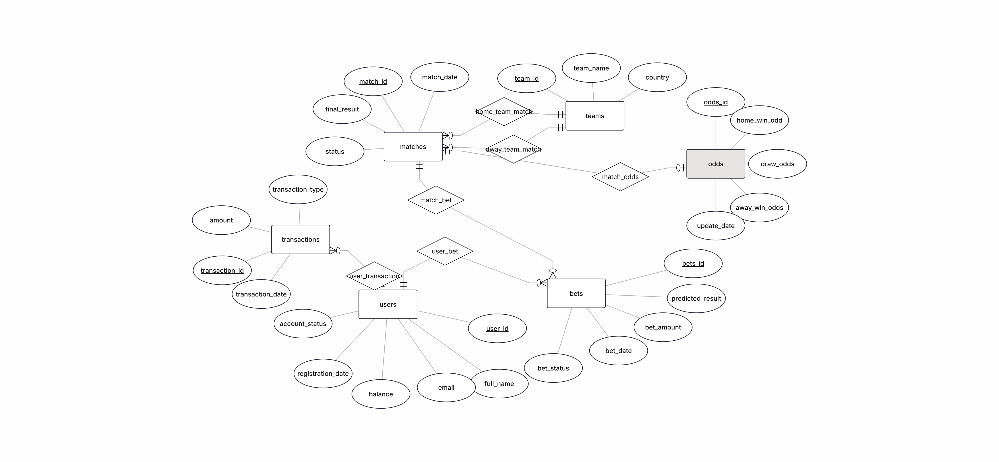
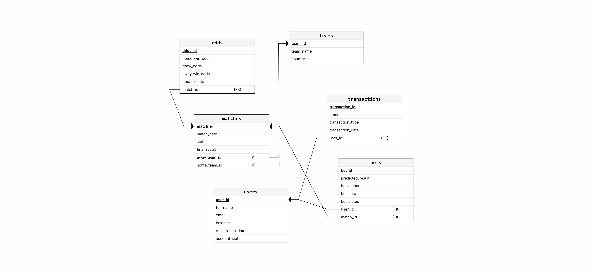
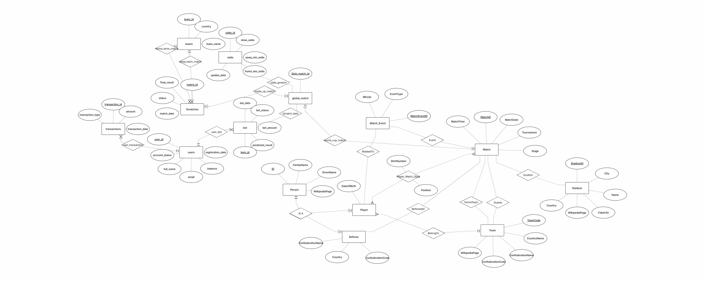
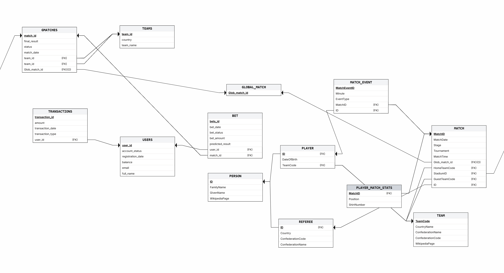

# דו"ח פרויקט - שלב ג': אינטגרציה ומבטים
פרק זה מתעד את תהליך מיזוג בסיס הנתונים הסטטיסטי של המונדיאל עם בסיס נתונים של מערכת הימורי ספורט שקיבלנו מזוג אחר. המטרה: יצירת מערכת מאוחדת המאפשרת ניהול משחקים וביצוע הימורים תחת קורת גג ארכיטקטונית אחת, ללא אובדן נתונים היסטוריים.

## 1. אלגוריתם הינדוס לאחור (Reverse Engineering)
על מנת ללמוד את מבנה מערכת ההימורים ולשלב אותה במערכת שלנו, פעלנו בשיטת הינדוס לאחור (Reverse Engineering) במספר שלבים עוקבים:

### שלב א': הקמת סביבה חיה ובחינת הסכמה הפיזית
קיבלנו מהאגף השני קובץ גיבוי (Backup.sql) והחלטנו לייבא אותו אל תוך בסיס נתונים פעיל בסביבת הפיתוח שלנו. המטרה הייתה לראות את הטבלאות "באוויר" במקום רק לקרוא קוד יבש. סקרנו את הטבלאות שנוצרו (users, bets, odds, matches וכו'), וחילצנו מתוכן את כל השדות, סוגי הנתונים (Data Types) והגדרות המפתחות הראשיים (PK).

### שלב ב': שרטוט מודל מבנה הנתונים (DSD)
על בסיס השדות שחילצנו, יצרנו את תרשים ה-DSD אשר משקף את הארכיטקטורה הפיזית של בסיס הנתונים. במקומות בהם הגיבוי שקיבלנו היה חסר (למשל, אילוצי מפתח זר - FK שלא הוגדרו במפורש ברמת ה-SQL), ביצענו "השלמות לוגיות" על בסיס היגיון בריא. הסקנו מתוך שמות העמודות (כמו user_id או match_id) אילו טבלאות תלויות אחת בשנייה כדי להשלים את תמונת המבנה הפיזי החסרה.

### שלב ג': הפשטה מודלית ותרגום ל-ERD
לאחר שהיה בידינו ה-DSD הפיזי, עלינו רמה אחת למעלה אל המודל המושגי. עברנו על כל טבלה ושאלנו "מה הישות הזו מייצגת בעולם האמיתי?".
זיהינו אילו טבלאות הן ישויות עצמאיות (למשל: 'משתמש', 'קבוצה'), ואילו הן טבלאות קשר או תנועה (למשל: 'הימור', שמקשר בין משתמש למשחק). את קשרי הגומלין (Relationships) בתרשים ה-ERD ביססנו על הלוגיקה העסקית של המערכת: הסקנו למשל שלמשתמש אחד יכולים להיות מספר הימורים (יחס 1:N), ושמשחק חייב להכיל יחסי זכייה מוגדרים. המעבר מהפיזי ללוגי נתן לנו את ההבנה העמוקה שנדרשה לקראת שלב האינטגרציה.

## 2. החלטות אדריכליות בשלב האינטגרציה
האתגר (ההתנגשות): שתי המערכות הכילו ישות של "משחק" (MATCH במונדיאל מול matches בהימורים). מכיוון שמערכת המונדיאל מכילה משחקים היסטוריים בעוד מערכת ההימורים מכילה משחקים שוטפים נפרדים, יצירת קשר ישיר (1:1) הייתה מאלצת מחיקת נתונים או יצירת כפילויות.

הפתרון - מודל ישות-על (Super-type): החלטנו ליישם ארכיטקטורה של מיפוי מרכזי. במקום לחבר את הטבלאות ישירות, יצרנו צומת מרכזי בדמות טבלה חדשה בשם GLOBAL_MATCH.

איך זה עובד: כל משחק מונדיאל וכל משחק הימורים קיבל "תעודת זהות" גלובלית בטבלה זו.

הקצאת קשרים בלעדית: טבלאות המערכת הפיננסית (bets ו-odds) נותקו מטבלת המשחקים המקורית שלהן, חוברו ישירות ל-GLOBAL_MATCH, והוחל עליהן אילוץ NOT NULL.

היתרון: ארכיטקטורה זו שומרת על שלמות הנתונים (Data Integrity), מונעת אנומליות, ומאפשרת למערכת לגדול ולקלוט בעתיד ענפי ספורט נוספים דרך אותו צומת.

## 3. תהליך הסבת הנתונים (Data Migration)
מכיוון שהאינטגרציה יצרה חיבור מבני חדש, נוצר נתק היסטורי: אף הימור במערכת המקורית לא הצביע על משחק מונדיאל. כדי להפיח חיים במערכת ולהדגים יכולות שליפה אינטגרטיביות, ביצענו תהליך צימוד (Pairing) מבוקר.

השתמשנו בטבלאות זמניות בזיכרון (CTEs) ובפונקציית החלוקה ROW_NUMBER().

בודדנו 10 משחקי הימורים שהכילו נתונים פיננסיים (הימורים ויחסי זכייה קיימים).

מיפינו אותם באופן חד-חד-ערכי ל-10 משחקי מונדיאל אקראיים, תוך הקפדה לא להשתמש בהגבלות LIMIT שגויות כדי למנוע דריסת נתונים וריבוי הימורים על אותו משחק פיקטיבי.

התהליך הוכח בהצלחה גם בסביבת הפיתוח לאחר התגברות על עומסי זיכרון (Memory Leaks) בקונטיינר של מסד הנתונים בעת הרצת שאילתות ה-Migration.

## 4. מבטים ושאילתות מורכבות (Views)
כדי לייעל את תהליך תשאול הנתונים דרך צומת המיפוי, פיתחנו שני מבטים המסתירים את מורכבות ה-JOIN מהמשתמש קצה.

מבט 1: WorldCup_Odds_View (מנקודת המבט של סטטיסטיקות המונדיאל)
תיאור המבט: המבט מציג את משחקי המונדיאל (תאריך, שלב, ושמות הנבחרות) משולבים יחד עם יחסי הזכייה (Odds) שהוצעו עבורם על ידי סוכנויות ההימורים.

שאילתה 1: משחקים עם פייבוריטית ברורה

תיאור: שליפת משחקי המונדיאל שבהם הקבוצה הביתית זכתה ליחס זכייה נמוך מ-2.0, ממוינים מהיחס הנמוך (הבטוח) ביותר כלפי מעלה.

קוד השאילתה:

SQL
SELECT HomeTeam, GuestTeam, Stage, home_win_odd 
FROM WorldCup_Odds_View 
WHERE home_win_odd < 2.0
ORDER BY home_win_odd ASC;
(לשלב כאן: צילום מסך של פלט השאילתה - 10 רשומות)

שאילתה 2: משחקים המועדים לתיקו

תיאור: שליפת 5 משחקי המונדיאל שמקבלים את יחס הזכייה הגבוה והמסוכן ביותר לתוצאת תיקו.

קוד השאילתה:

SQL
SELECT MatchDate, HomeTeam, GuestTeam, draw_odds 
FROM WorldCup_Odds_View 
ORDER BY draw_odds DESC 
LIMIT 5;
(לשלב כאן: צילום מסך של פלט השאילתה)

מבט 2: Bettors_On_WorldCup_View (מנקודת המבט של מערכת ההימורים)
תיאור המבט: המבט מרכז את הפעילות הפיננסית של המשתמשים, ומציג את השם המלא של המהמר, סכום ההימור, התוצאה החזויה, ופרטי משחק המונדיאל המדויק שעליו התבצע ההימור.

שאילתה 1: פרופיל מהמרים מובילים

תיאור: שליפת משתמשים שהשקיעו מעל 50 יחידות מטבע במשחק מונדיאל יחיד, מסודרים בסדר יורד של סכום ההימור כדי לזהות לקוחות VIP.

קוד השאילתה:

SQL
SELECT Bettor_Name, bet_amount, predicted_result, HomeTeam, GuestTeam 
FROM Bettors_On_WorldCup_View 
WHERE bet_amount > 50
ORDER BY bet_amount DESC;
(לשלב כאן: צילום מסך של פלט השאילתה - 10 רשומות)

שאילתה 2: ניתוח מחזורי מסחר למשחק

תיאור: ביצוע אגרגציה (SUM ו-GROUP BY) לחישוב סך כל הכסף שהושקע על כל משחק מונדיאל בנפרד, מה שמאפשר לזהות אילו משחקים משכו את מירב תשומת הלב הכלכלית.

קוד השאילתה:

SQL
SELECT MatchDate, HomeTeam, GuestTeam, SUM(bet_amount) AS Total_Money_Placed
FROM Bettors_On_WorldCup_View
GROUP BY MatchDate, HomeTeam, GuestTeam
ORDER BY Total_Money_Placed DESC;
(לשלב כאן: צילום מסך של פלט השאילתה)