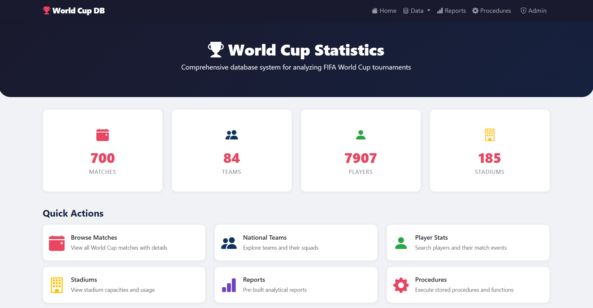
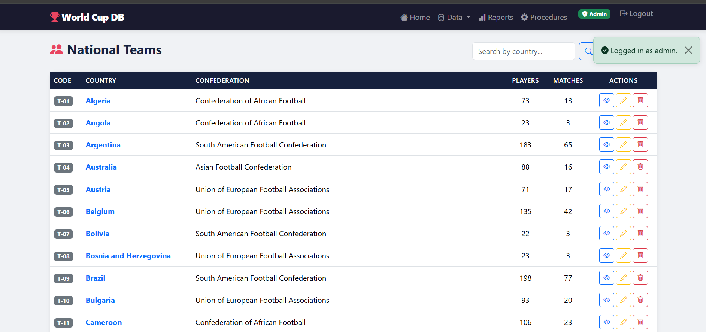
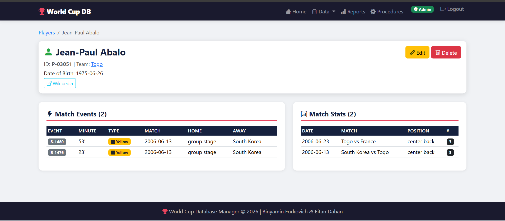
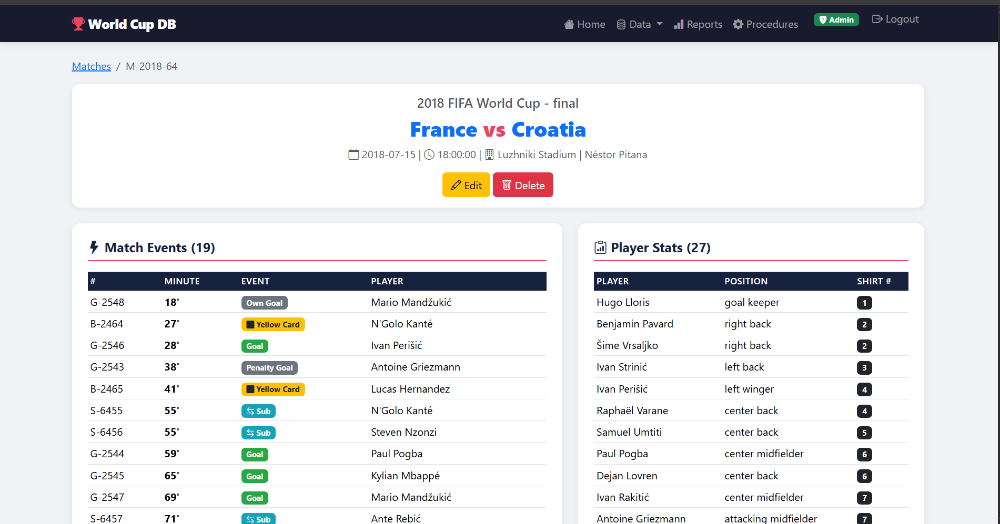
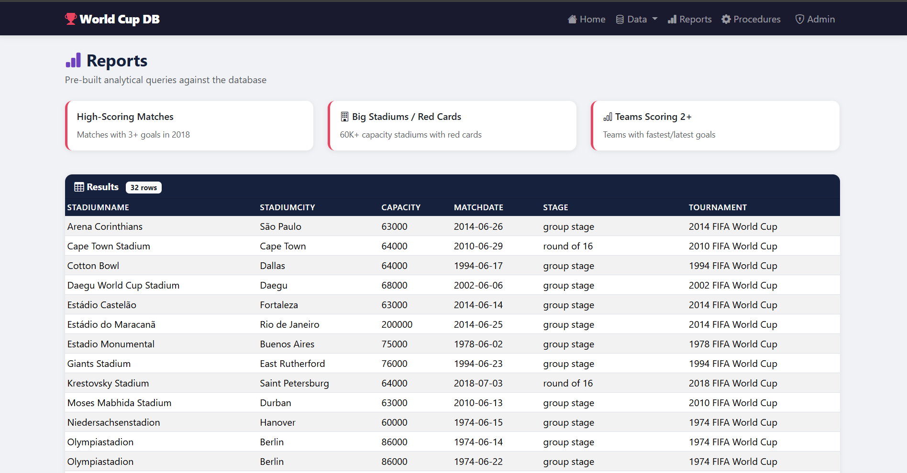
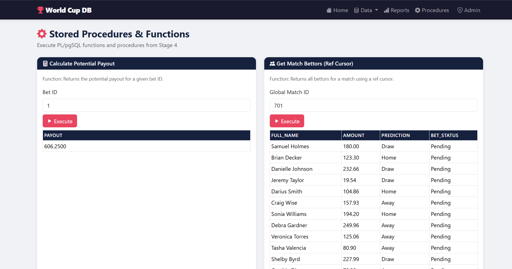
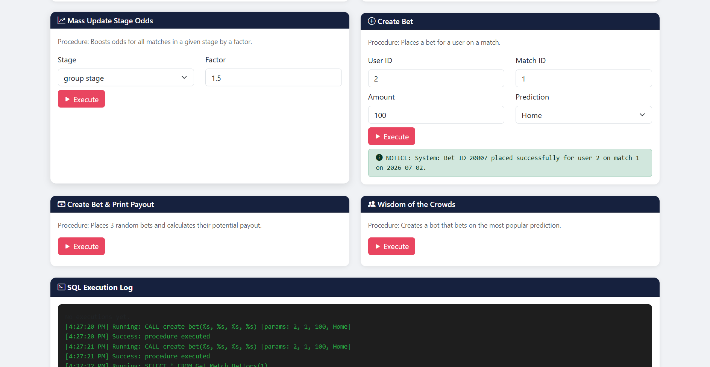
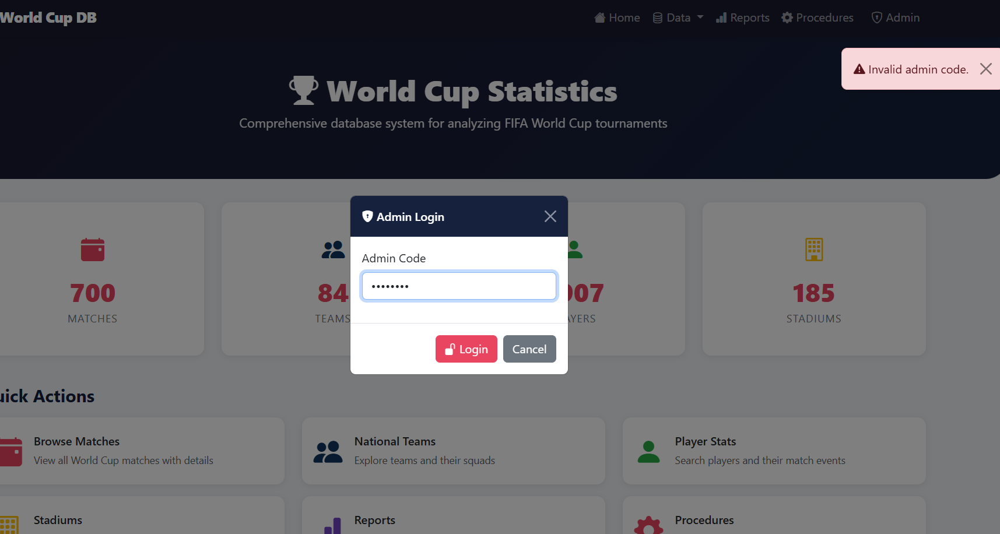

# דו"ח פרויקט - שלב 5: יצירת ממשק גרפי (GUI)
## מבוא
בשלב זה של הפרויקט פיתחנו ממשק משתמש גרפי (GUI) מבוסס Web המאפשר גישה, ניהול ותפעול של בסיס הנתונים שלנו בצורה אינטואיטיבית וידידותית למשתמש. המערכת תוכננה כך שתתממשק בצורה ישירה לכלל הטבלאות, תוך שימת דגש על חוויית משתמש (UI/UX) ותצוגת נתונים ברורה (המרת מפתחות זרים לשמות משמעותיים)
## הסבר על דרך העבודה והכלים (Workflow & Tools)
האפליקציה פותחה כ-Web Application מלא תוך שימוש בכלים הבאים:
* **צד שרת (Backend):** הפיתוח נעשה בשפת **Python** תוך שימוש ב-Micro-framework **Flask** לצורך ניהול הניתובים (Routes) והלוגיקה.
* **התממשקות למסד הנתונים:** השתמשנו בספריית **psycopg2** כדי לייצר חיבור (Connection) ישיר מול PostgreSQL, להריץ שאילתות, ולזמן פרוצדורות ופונקציות. הכל מנוהל דרך מודול `db_connection.py`.
* **צד לקוח (Frontend):** הממשק נבנה באמצעות **HTML/CSS** בשילוב מנוע התבניות **Jinja2** (להזרקת נתונים דינמיים) וספריית **Bootstrap 5** לעיצוב רספונסיבי ומודרני.
* **אבטחה והרשאות:** המערכת מנוהלת דרך Session. משתמש רגיל יכול רק לצפות בנתונים (Read-Only), ואילו משתמש מנהל (Admin) מקבל הרשאות לבצע פעולות CRUD (יצירה, עדכון, מחיקה) לאחר הזנת קוד סודי.
---
## עקרונות הממשק שנישמרו במדויק:
1. **הסתרת מזהים (IDs):** בכל מקום בו נדרש מפתח זר, ביצענו `JOIN` כדי להציג את הערך המשמעותי (למשל, שם הנבחרת במקום קוד הנבחרת).
2. **עדכון מבוסס שליפה מוקדמת:** במסכי העדכון (Update), המערכת מבקשת את מזהה הרשומה, שולפת את כל הנתונים הקיימים ומציגה אותם בטופס, כך שהמשתמש יכול לערוך רק את מה שצריך.
3. **עיצוב מרשים:** השקענו בנראות מרשימה (דאשבורד עם כרטיסיות) וחוויית משתמש מודרנית לפי הדרישות.
---
## הוראות התקנה והפעלה

### דרישות מקדימות
- Docker מותקן ומורץ.
- קובץ `.env` נמצא בתיקיית הפרויקט הראשית ומכיל את משתני הסביבה הנדרשים.

### התקנה והפעלה בפקודה אחת
1. העתיקו את תיקיית הפרויקט למחשב.
2. הריצו את התקנת מסד הנתונים:
   ```bash
   docker compose --profile setup run --rm setup
   ```
3. הריצו את מסד הנתונים והאפליקציה:
   ```bash
   docker compose up -d db web
   ```
4. פתחו בדפדפן את הכתובת:
   `http://localhost:5000`

### עצירת האפליקציה
```bash
docker compose down
```

### הרשאות
- משתמש רגיל: צפייה בלבד בכל המסכים.
- מנהל (Admin): לחץ על כפתור Admin בשורת הניווט והזן קוד. ברירת המחדל היא `admin_code123`.

### ארכיטקטורת הקבצים
```text
stage_5/
  app.py                   - כניסת האפליקציה (Flask)
  db_connection.py         - חיבור למסד + פונקציות עזר
  routes/                  - מודולי ניתוב
  templates/               - תבניות HTML (Bootstrap 5)
  setup/
    setup.sh               - סקריפט התקנה מלא (רץ דרך Docker)
    install_objects.sql    - התקנת כל אובייקטי המסד
  sql/
    full_install.sql       - יצירת טבלאות המונדיאל בלבד
    install.sql            - תוספות שלב 5 בלבד
```

---
## פירוט מסכי המערכת ותמונות מסך
### 1. מסך הבית (Home / Dashboard)
מסך הכניסה המרכזי של האפליקציה ממנו ניתן לנווט לכל המודולים. המסך מציג סטטיסטיקות ומונה רשומות (Total Matches, Teams, etc.) ישירות מהדאטה-בייס.

### 2. מסכי ניהול (CRUD)
מסכים אלו מאפשרים קריאה (Read), הוספה (Create), עדכון (Update) ומחיקה (Delete). פעולות העריכה והמחיקה מוגנות בדרישת התחברות ל-Admin.
* **ניהול נבחרות (Teams):** צפייה בנבחרות מחוברות לסטטיסטיקות ולשחקנים.

* **ניהול שחקנים (Players):** הוספה ועריכה של שחקנים, תצוגת שמות במקום מפתחות.

* **ניהול משחקים, אצטדיונים ושופטים:** מערכת ניהול מלאה לכל ישות בבסיס הנתונים.

### 3. מסך שאילתות מתקדמות (Queries)
מסך המאפשר הרצה בלחיצת כפתור של השאילתות שיצרנו בשלב ב', ביניהן: משחקים עם יותר מ-3 שערים, אצטדיונים עם כרטיסים אדומים, ועוד.

### 4. מסך הפעלת לוגיקה עסקית (Procedures & Functions)
מסך המוקדש להפעלת הפונקציות והפרוצדורות מתוך שלב ד', המאפשר הרצת סימולציות הימורים, חישובי פוטנציאל זכייה (Calculate Potential Payout), עדכון יחסים המוני ועוד.



### 5. מסך התחברות (Admin Login)
מודול המאפשר להזין סיסמת מנהל על מנת לחשוף את כפתורי ה-Edit/Delete/Add בכל המסכים.

---

